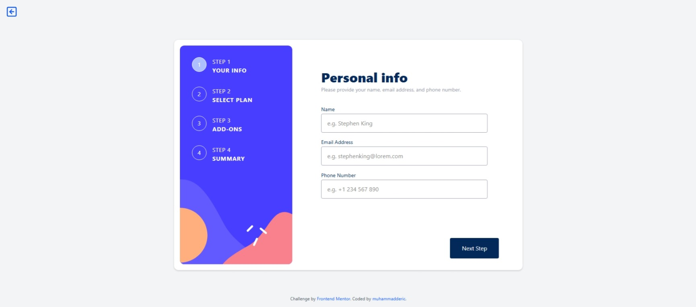

# Frontend Mentor - Multi-step form



# Multi-Step Form Application

A responsive multi-step form built with React, TypeScript, Redux Toolkit, and Tailwind CSS. This application guides users through a subscription process with personal information, plan selection, add-ons, and confirmation steps.

## 🚀 Features

- **Multi-step Form Flow**: 5-step progressive form (Personal Info → Plan Selection → Add-ons → Summary → Confirmation)
- **State Management**: Centralized state management using Redux Toolkit
- **Type Safety**: Full TypeScript support with comprehensive type definitions
- **Responsive Design**: Mobile-first approach with responsive layouts for tablet and desktop
- **Form Validation**: Client-side validation for personal information fields
- **Dynamic Pricing**: Monthly/Yearly billing toggle with automatic price updates

## 📋 Steps Overview

1. **Personal Information**: Collect name, email, and phone number
2. **Select Plan**: Choose between Arcade, Advanced, or Pro plans with monthly/yearly billing
3. **Add-ons**: Select optional add-ons to enhance the experience
4. **Summary**: Review all selections before confirmation
5. **Confirmation**: Thank you message after successful submission

## 🛠️ Technologies Used

- **React 18** with TypeScript
- **Redux Toolkit** for state management
- **Tailwind CSS** for styling
- **Vite** as build tool
- **React Redux** for React bindings

## 📁 Project Structure

```
src/
├── app/
│   ├── store.ts           # Redux store configuration
│   └── hooks.ts           # Typed Redux hooks
├── challenges/
│   └── advanced/
│       └── multi-step-form/
│           ├── components/
│           │   ├── Sidebar.tsx
│           │   ├── SidebarItem.tsx
│           │   ├── MainContent.tsx
│           │   ├── MainContentTitle.tsx
│           │   ├── PersonalInfo.tsx
│           │   ├── UserPlan.tsx
│           │   ├── AddOns.tsx
│           │   ├── AddOn.tsx
│           │   ├── Summary.tsx
│           │   ├── Confirmation.tsx
│           │   └── StepButtons.tsx
│           └── store/
│               ├── index.ts
│               ├── types.ts
│               └── slices/
│                   ├── stepSlice.ts
│                   ├── personalInfoSlice.ts
│                   ├── userPlanSlice.ts
│                   └── addOnsSlice.ts
└── styles/
    └── index.css         # Global styles with Tailwind
```

## 🤝 Contributing

1. Fork the repository
2. Create a feature branch (`git checkout -b feature/amazing-feature`)
3. Commit changes (`git commit -m 'Add amazing feature'`)
4. Push to branch (`git push origin feature/amazing-feature`)
5. Open a Pull Request

## 📄 License

This project is licensed under the MIT License.

## 🙏 Acknowledgments

- Design inspiration from modern multi-step form patterns
- Redux Toolkit for excellent state management
- Tailwind CSS for utility-first styling approach

## 📧 Contact

**Developed by muhammadderic**  
[My GitHub Profile](https://github.com/muhammadderic)