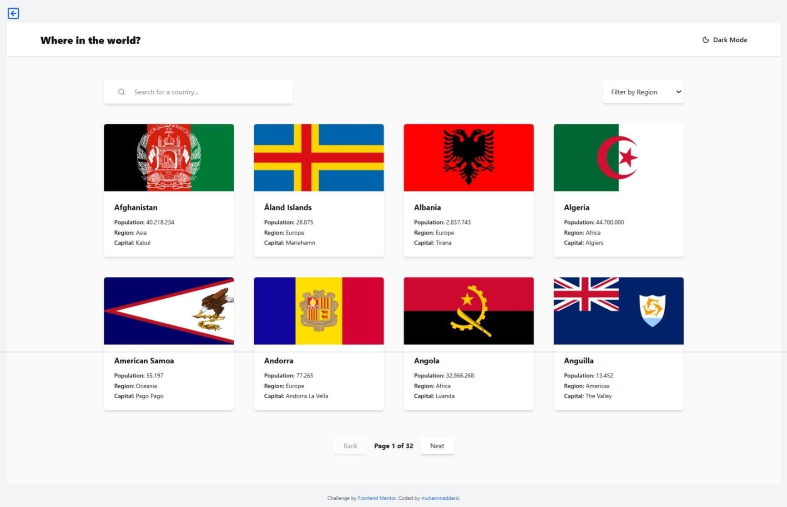
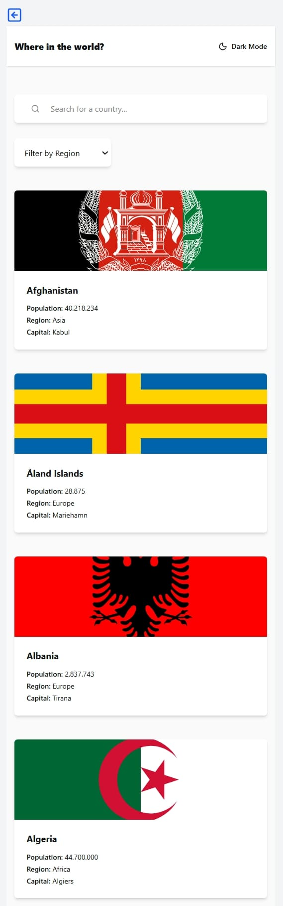

# Frontend Mentor - REST Countries API with color theme switcher solution

This is a solution to the [REST Countries API with color theme switcher challenge on Frontend Mentor](https://www.frontendmentor.io/challenges/rest-countries-api-with-color-theme-switcher-5cacc469fec04111f7b848ca). Frontend Mentor challenges help you improve your coding skills by building realistic projects. 

## Table of contents

- [Overview](#overview)
  - [The challenge](#the-challenge)
  - [My Project](#my-project)
  - [Screenshot](#screenshot)
  - [Links](#links)
- [My process](#my-process)
  - [Built with](#built-with)
  - [Continued development](#continued-development)
  - [AI Collaboration](#ai-collaboration)
- [Author](#author)

## Overview

### The challenge
Users should be able to:
- See all countries from the API on the homepage
- Search for a country using an `input` field
- Filter countries by region
- Click on a country to see more detailed information on a separate page
- Click through to the border countries on the detail page
- Toggle the color scheme between light and dark mode *(optional)*

### My Project
This project is a high-performance web application designed to help users explore global data through the REST Countries API. Built with a focus on speed and user experience, the application allows users to browse an extensive list of country flags and details with seamless navigation.

#### Key Features:
- **Dynamic Search:** Real-time filtering to find countries instantly by name.
- **Region Filtering:** Easily narrow down countries based on their geographical continent.
- **Efficient Pagination:** Optimized data handling to ensure smooth browsing across hundreds of entries.
- **Dark Mode System:** A fully integrated theme-switching experience using Tailwind CSS v4 for comfortable viewing in any environment.

### Screenshots

  
    
  

### Links
- Solution URL: [The solution URL here](https://www.frontendmentor.io/solutions/rest-countries-api-bVDbR3eSe8)
- Live Site URL: [THe live site URL here](https://deric-frontendmentor.vercel.app/adv/countries)

## My process

### Built With
- [React](https://reactjs.org/) - JS Library
- [Vite](https://vitejs.dev/) - Next Generation Frontend Tooling
- [TypeScript](https://www.typescriptlang.org/) - For strict type safety
- [Tailwind CSS v4](https://tailwindcss.com/) - For modern, utility-first styling
- [Lucide React](https://lucide.dev/) - For clean, consistent iconography

### Continued Development
Moving forward, I plan to deepen the user experience by adding more granular data visualizations and interactive elements. Future updates will focus on:
- **Interactive Border Navigation:** Allowing users to click on border country codes to navigate directly to that country's detail page.
- **Refined Data State:** Transitioning from local JSON to full API integration with caching to handle real-time data updates.
- **Advanced UI Transitions:** Implementing Framer Motion for smoother page transitions between the home grid and the detailed country view.

### AI Collaboration
I utilized AI as a collaborative partner to augment the development process of this project. While the core architectural decisions, logic flow, and essential code are of my own design, I leveraged AI to refactor complex components, optimize my TypeScript interfaces, and explore the latest features of Tailwind CSS v4. This synergy allowed me to move from a functional idea to a highly polished, production-ready implementation more efficiently.

## Author
- Frontend Mentor - [@muhammadderic](https://www.frontendmentor.io/profile/muhammadderic)
- Github - [@muhammadderic](https://github.com/muhammadderic)