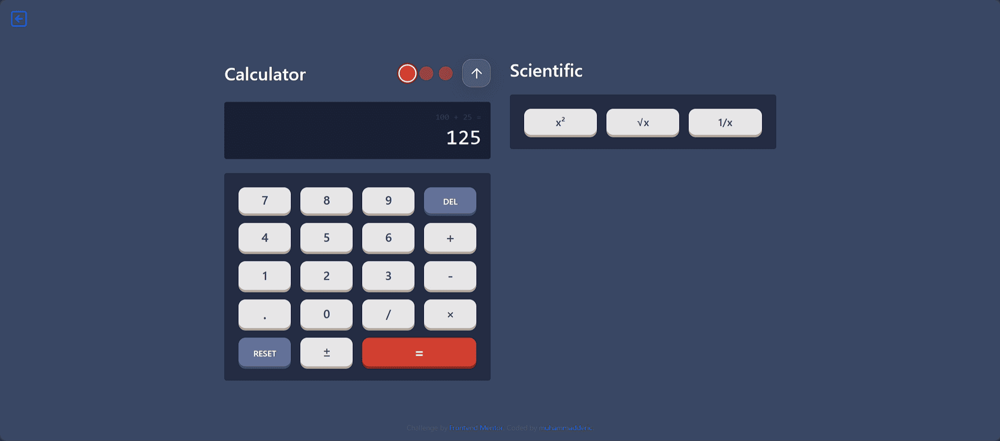
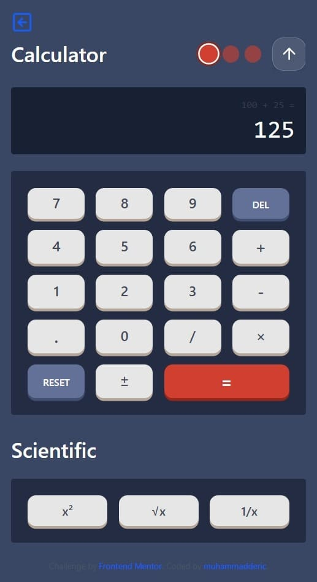

# Frontend Mentor - Calculator app solution

This is a solution to the [Calculator app challenge on Frontend Mentor](https://www.frontendmentor.io/challenges/calculator-app-9lteq5N29). Frontend Mentor challenges help you improve your coding skills by building realistic projects. 

## Table of contents

- [Overview](#overview)
  - [The challenge](#the-challenge)
  - [Screenshot](#screenshot)
  - [Links](#links)
- [My process](#my-process)
  - [Built with](#built-with)
  - [Continued development](#continued-development)
  - [AI Collaboration](#ai-collaboration)
- [Author](#author)
- [Acknowledgments](#acknowledgments)

## Overview

### The challenge

Users should be able to:

- See the size of the elements adjust based on their device's screen size
- Perform mathmatical operations like addition, subtraction, multiplication, and division
- Adjust the color theme based on their preference
- This calculator also supports scientific calculations such as square, root, and 1/x.

### Screenshot

  
    
  

### Links

- Solution URL: [https://www.frontendmentor.io/profile/muhammadderic?tab=solutions](https://www.frontendmentor.io/profile/muhammadderic?tab=solutions)
- Live Site URL: [https://deric-frontendmentor.vercel.app/junior/calculator](https://deric-frontendmentor.vercel.app/junior/calculator)

## My process

### Built with

- Built with:
  - [React Vite](https://vitejs.dev/) - Development server
  - [TypeScript](https://www.typescriptlang.org/) - Statically typed JavaScript
  - [Redux](https://redux.js.org/) - State management
  - [Tailwind CSS](https://tailwindcss.com/) - CSS utility-first framework
  - [React Router DOM](https://reactrouter.com/) - Client-side routing

## Continued development

Future improvements for this calculator could include adding extended scientific functions to support mathematical and scientific activities. This could involve adding trigonometric functions, logarithmic functions, and exponential functions, as well as the ability to perform calculations with complex numbers. Additionally, the calculator could be improved by adding a memory function to store previously calculated results, and a history function to track previous calculations.

## AI Collaboration

I used AI as my supporter, providing suggestions and ideas. However, the core idea and implementation were mine.

## Author

- Frontend Mentor - [@muhammadderic](https://www.frontendmentor.io/profile/muhammadderic)
- Github - [@muhammadderic](https://github.com/muhammadderic)
